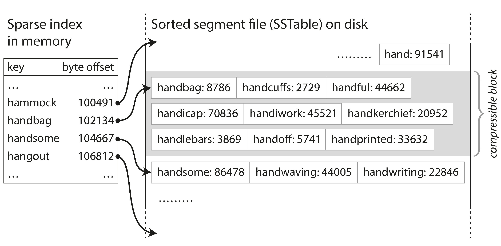
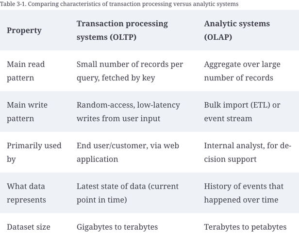

# Chapter 3. Storage and Retrieval

- This chapter is about understanding how we can store data and how we can find it again
- App developers do need to select appropriate storage engine from the many that are available 
- We will examine two families of storage engines: log-structured storage engines and page-oriented storage engines such as B-trees
- Word Log is used in a general sense: an append only sequence of records. It's intended for machines to read
- index data structure typically used to increase the lookup speed. However it maintains some metadata which incurs overhead in maintaining it.
  - Index slows the write operation, because index needs to be udpated on each write operation
  - It is an important  trade-off in storage systems:
    - A well-chosen indexes speed up read queries but every index slows down writes
    - Use application knowledge or typical query pattern to add indexes

- Hash Indexes
  - Bitcask storage strategy
  - Has a good performance for read and writes provided all keys fit in memory
    - In-memory map where key is mapped to a byte offset in the data file
      - The location at which the value can be found 
  - Append only log 
    - how to avoid running out of space?
      - Break the log into segments of a certain size by closing a segment file when it reaches certain size
      - We can then do compaction on these segments
        - Compaction means throwing away duplicate keys in the log and keeping only the most recent update for each key
      - Segments can also be merged together at the same time 
      - Segments are immutable so the merged segments are written to a new file
      - Merging and compaction is done in the background thread
      - We can still continue to serve read requests using the old segment files and write requests to the latest segment file
      - After merging process is completed, we switch read requests to using the new merged segment instead of old segments
        - Old segments files can simply be deleted
  
### SSTables and LSM-Trees
- Sorted String Table: sequence of key value pair sorted by key
- During merging SSTable segments, when same key is present in different segments, we can keep the most recent segment value
- For finding a key we don't need a full hash index in memory, due to sorted nature we can use range to decide potential. Only few keys are needed in memory to maintain the offsets for some of the keys, but it can be sparse
- 
#### Constructing and maintaining SSTables
- Maintaining sorted structure in memory: RedBlackTree, AVL Tree
- Write out the sorted structure (Trees mentioned above) called memtable to the disk when it reaches certain size
- Read requests can be served by looking up in the memtable first, then from the most recent segment of db and then in next older segment
- Run merging and compaction from time to time to combine segments and to discard overwritten or deleted values

#### Making an LSM-tree (Log structured Merge Tree) out of SSTables
- Storage engines that are based on this principle of merging and compacting sorted files are often called LSM storage engines
- Lucene indexing engine for full-text search used by Elasticsearch and solr
- Given a word in a search query, find all the documents (web pages, product descriptions, etc.) that mention the word. This is implemented with a key-value structure where the key is a word (a term) and the value is the list of IDs of all the documents that contain the word (the postings list). In Lucene, this mapping from term to postings list is kept in SSTable-like sorted files, which are merged in the background as needed.

#### Performance Optimization
- LSM-tree algorithm can be slow when looking up keys that do not exist in the database:
  - You have to check memtable, then the segments all the way back to the oldest
- In order to optimize this kind of access, storage engines often use additional Bloom filters 
- A Bloom filter is a memory-efficient data structure for approximating the contents of a set. It can tell you if a key does not appear in the database, and thus saves many unnecessary disk reads for non existent keys

### B-Trees
- B-Tree: Most commonly used indexing structure
- Introduced in 1970
- Standard index implementation in almost all the relational databases
- Stood the test of time
- Like SSTables, B-trees keep key-value pairs sorted by key, which allows efficient key value lookups and range queries.
- Log Structured indexex break down db in to variable size segments and always write a segment sequentially.
- However B-trees break the db down intpo fixed-size blocks or pages, (4KB typically) and read or write one page at a time.
- Design corresponds more closely to the underlying hardware as discks are also arranged in fixed-sized blocks
- Each page has address or location but on disk instead of in memory
- 
- Root page contains several keys and references to child pages
- Each child is responsible for a continuous range of keys and the keys between the references indicate where the boundaries between those ranges lie
- The number of references to child pages in one page of the B-tree is called the branching factor
- Btree algorithm ensures that the tree remains balanced: a B-tree with n keys always has a depth of O(log n). Most databases can fit into a B-tree that is three or four levels deep, so you don’t need to follow many page references to find the page you are looking for.
  - (A four-level tree of 4 KB pages with a branching factor of 500 can store up to 256 TB.)
- To make B-trees resilient, a on-disk WAL (write ahead log) is used to write each modification before its applied to the pages of the tree. 
  - This log is used to restore db in consistent state when db comes back up after crash
- Protection concurrent threads is achieved by lightweight locks

#### Comparing B-Trees and LSM-Trees
- Even though B-tree implementations are generally more mature than LSM-tree implementations, LSM-trees are also interesting due to their performance characteristics. 
- As a rule of thumb, LSM-trees are typically faster for writes, whereas B-trees are thought to be faster for reads.
- Reads are typically slower on LSM-trees because they have to check several different data structures and SSTables at different stages of compaction.

- Write Amplification
  - One write to the database resulting in multiple writes to the disk over the course of the database’s lifetime
#### Advantages of LSM-trees
- LSM-trees are typically able to sustain higher write throughput than B-trees, partly because they sometimes have lower write amplification (although this depends on the storage engine configuration and workload), and partly because they sequentially write compact SSTable files rather than having to overwrite several pages in the tree. This difference is particularly important on magnetic hard drives, where sequential writes are much faster than random writes.

#### Downsides of LSM-trees
- A downside of log-structured storage is that the compaction process can sometimes interfere with the performance of ongoing reads and writes.
- The impact of compaction and merging on throughput & response time is minimal but at higher percentiles the response time of queries to LSM storage engine can sometimes be quite high and B-trees can be more predictable
- Disk has finite write bandwidth, it has to share it with write operations and thread handling compaction. When the DB is empty all bandwidth can be used for initial writes but as the size increases' compaction needs to be performed.
  - If the rate of writes is higher than compaction can keep up with, number of unmerged segments keeps growing until disk run of space and reads become slower as they need to check more segments
- An advantage of B-trees is that each key exists in exactly one place in the index, whereas a log-structured storage engine may have multiple copies of the same key in different segments
- B-trees are very ingrained in the architecture of databases and provide consistently good performance for many workloads, so it’s unlikely that they will go away anytime soon. 
- In new datastores, log-structured indexes are becoming increasingly popular. 
- There is no quick and easy rule for determining which type of storage engine is better for your use case, so it is worth testing empirically.

- Secondary index
  - Secondary index in relational database speeds up the application query 
  - Key is what client searches for and value is the actual row, document or vertex
  - If the value is stored within the index, its called clustered index
    - Clustered index speeds up reads, increase space requirements 
    - Clustered index adds the additional overhead to provide transactional guarantees so application have the consistent view of data
  - if the reference to value in heap(heapfile) is stored in the index then its non-clustered index
  - A compromise between a clustered index (storing all row data within the index) and a nonclustered index (storing only references to the data within the index) is known as a covering index or index with included columns, which stores some of a table’s columns within the index. 
    - This allows some queries to be answered by using the index alone (in which case, the index is said to cover the query)

- Full-text Search
  - To cope with typos in documents or queries, Lucene is able to search text for words within a certain edit distance (an edit distance of 1 means that one letter has been added, removed, or replaced)
  - Lucene uses a SSTable-like structure for its term dictionary. This structure requires a small in-memory index that tells queries at which offset in the sorted file they need to look for a key. In LevelDB, this in-memory index is a sparse collection of some of the keys, but in Lucene, the in-memory index is a finite state automaton over the characters in the keys, similar to a trie [38]. This automaton can be transformed into a Levenshtein automaton, which supports efficient search for words within a given edit distance [39].

- Keeping everything in memory
  - Counterintuitively, the performance advantage of in-memory databases is not due to the fact that they don’t need to read from disk. 
    - Even a disk-based storage engine may never need to read from disk if you have enough memory, because the operating system caches recently used disk blocks in memory anyway. 
    - Rather, they can be faster because they **can avoid the overheads of encoding in-memory data structures** in a form that can be written to disk.
  - Besides performance, another interesting area for in-memory databases is providing data models that are difficult to implement with disk-based indexes.

#### Transaction Processing or Analytics?
- In the early days of business data processing, a write to the database typically corresponded to a commercial transaction taking place: making a sale, placing an order with a supplier, paying an employee’s salary, etc. As databases expanded into areas that didn’t involve money changing hands, the term transaction nevertheless stuck, referring to a group of reads and writes that form a logical unit.
- Typically, applications looks up few records by key using index. Records are inserted or updated based on the users input. Because these operations are interactive the access pattern became know as online transaction processing(OLTP)
- Databases also started being increasingly used for data analytics, which has very different access patterns. 
  - Usually an analytic query needs to scan over a huge number of records, only reading a few columns per record, and calculates aggregate statistics (such as count, sum, or average) rather than returning the raw data to the user
  -  The meaning of online in OLAP is unclear; it probably refers to the fact that queries are not just for predefined reports, but that analysts use the OLAP system interactively for explorative queries.
- 

- Data Warehouse
  - A data warehouse, by contrast, is a separate database that analysts can query to their hearts’ content, without affecting OLTP operations [48]. The data warehouse contains a read-only copy of the data in all the various OLTP systems in the company. Data is extracted from OLTP databases (using either a periodic data dump or a continuous stream of updates), transformed into an analysis-friendly schema, cleaned up, and then loaded into the data warehouse. This process of getting data into the warehouse is known as Extract–Transform–Load (ETL)
  - A big advantage of using a separate data warehouse, rather than querying OLTP systems directly for analytics, is that the data warehouse can be optimized for analytic access patterns
  - On the surface, a data warehouse and a relational OLTP database look similar, because they both have a SQL query interface. However, the internals of the systems can look quite different, because they are optimized for very different query patterns. Many database vendors now focus on supporting either transaction processing or analytics workloads, but not both.
  - Data warehouse vendors such as Teradata, Vertica, SAP HANA, and ParAccel typically sell their systems under expensive commercial licenses. Amazon RedShift is a hosted version of ParAccel. More recently, a plethora of open source SQL-on-Hadoop projects have emerged; they are young but aiming to compete with commercial data warehouse systems. These include Apache Hive, Spark SQL, Cloudera Impala, Facebook Presto, Apache Tajo, and Apache Drill [52, 53]. Some of them are based on ideas from Google’s Dremel [54].
  - Start Schema
    - The name “star schema” comes from the fact that when the table relationships are visualized, the fact table is in the middle, surrounded by its dimension tables; the connections to these tables are like the rays of a star.
  - Snowflake Schema
    - A variation of this template is known as the snowflake schema, where dimensions are further broken down into subdimensions.
  - Snowflake schemas are more normalized than star schemas, but star schemas are often preferred because they are simpler for analysts to work with [55].
  - In a typical data warehouse, tables are often very wide: fact tables often have over 100 columns, sometimes several hundred [51]. Dimension tables can also be very wide, as they include all the metadata that may be relevant for analysis—
- Column Oriented Storage 
  - In most OLTP databases, storage is laid out in a row-oriented fashion: all the values from one row of a table are stored next to each other. Document databases are similar: an entire document is typically stored as one contiguous sequence of bytes.
  - The idea behind column-oriented storage is simple: don’t store all the values from one row together, but store all the values from each column together instead. If each column is stored in a separate file, a query only needs to read and parse those columns that are used in that query, which can save a lot of work
  - COLUMN-ORIENTED STORAGE AND COLUMN FAMILIES 
    - Cassandra and HBase have a concept of column families, which they inherited from Bigtable [9]. However, it is very misleading to call them column-oriented: within each column family, they store all columns from a row together, along with a row key, and they do not use column compression. Thus, the Bigtable model is still mostly row-oriented.
- Aggregation: Data Cubes and Materialized Views
  - A common special case of a materialized view is known as a data cube or OLAP cube [64]. 
    - It is a grid of aggregates grouped by different dimensions. 
    - Each cell contains the calculated info for a particular column combination. These values can then repeatedly be summarized along each of the dimensions.
    - The advantage of a materialized data cube is that certain queries become very fast because they have effectively been precomputed
    - The disadvantage is that a data cube doesn’t have the same flexibility as querying the raw data.
    - Most data warehouses therefore try to keep as much raw data as possible, and use aggregates such as data cubes only as a performance boost for certain queries.

#### Summary
- In this chapter we tried to get to the bottom of how databases handle storage and retrieval. What happens when you store data in a database, and what does the database do when you query for the data again later?
- On a high level, we saw that storage engines fall into two broad categories: those optimized for transaction processing (OLTP), and those optimized for analytics (OLAP). There are **big differences between the access patterns** in those use cases:
- OLTP systems are typically user-facing, which means that they may see a huge volume of requests. In order to handle the load, applications usually only touch a small number of records in each query. The application requests records using some kind of key, and the storage engine uses an index to find the data for the requested key. **Disk seek time is often the bottleneck here**.
- Data warehouses and similar analytic systems are less well known, because they are **primarily used by business analysts**, not by end users. They handle a much lower volume of queries than OLTP systems, but each **query is typically very demanding**, **requiring many millions of records to be scanned in a short time**. **Disk bandwidth (not seek time) is often the bottleneck here, and column-oriented storage is an increasingly popular solution for this kind of workload**.
- On the OLTP side, we saw storage engines from **two main schools of thought**:
- The _log-structured school_, which only permits **appending to files and deleting obsolete files**, but never updates a file that has been written. **Bitcask, SSTables, LSM-trees, LevelDB, Cassandra, HBase, Lucene, and others belong to this group**.
- The _update-in-place_ school, which **treats the disk as a set of fixed-size pages that can be overwritten**. B-trees are the biggest example of this philosophy, being used in all major relational databases and also many nonrelational ones.
- **Log-structured storage engines** are a **comparatively recent development**. Their key idea is that **they systematically turn random-access writes into sequential writes on disk**, which enables higher write throughput due to the performance characteristics of hard drives and SSDs.
- Finishing off the OLTP side, we did a brief tour through some more complicated indexing structures, and databases that are optimized for keeping all data in memory.
- We then took a detour from the internals of storage engines to look at the high-level architecture of a typical data warehouse. This background illustrated why analytic workloads are so different from OLTP: when your queries require sequentially scanning across a large number of rows, indexes are much less relevant. Instead it becomes important to encode data very compactly, to minimize the amount of data that the query needs to read from disk. We discussed how column-oriented storage helps achieve this goal.
- As an application developer, if you’re armed with this knowledge about the internals of storage engines, you are in a much better position to know which tool is best suited for your particular application. If you need to adjust a database’s tuning parameters, this understanding allows you to imagine what effect a higher or a lower value may have.
- Although this chapter couldn’t make you an expert in tuning any one particular storage engine, it has hopefully equipped you with enough vocabulary and ideas that you can make sense of the documentation for the database of your choice.

