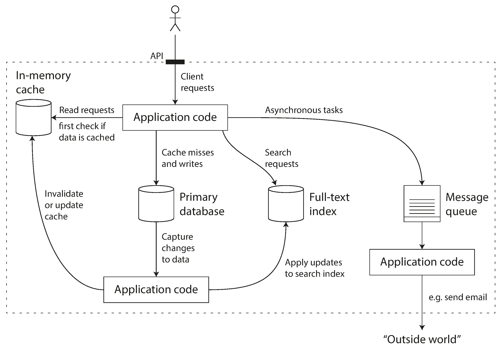

# designing-data-intensive-applications-notes
Notes on book Designing Data Intensive Applications 
- References:
  - https://github.com/ept/ddia-references

# Chapter 1: Reliable, scalable and Maintainable Applications
- In this book, focus is on these three concerns
- Reliability 
    - System does its job at desired performance even when faults occur
    - Tolerating hardware and software faults, human error 
- Scalability
    - As the system grows in data, traffic or complexity, it should deal with the growth reasonably.
    - Measuring load and performance, latency percentiles, throughput
- Maintainability
    - Multiple people work on the software over time, they should be able to work productively.
    - Operability, simplicity and evolvability

- Many applications today are data intensive as opposed to compute intensive
- Actual problems are amount of data, complexity of data and the speed at which it is changing
- Application works with various data systems optimized for different access patterns and use cases 
  - Caches(redis,memcached), Message queues(kafka,rabbitmq), Search indexes(solr,elastic search), databases(sql,nosql) 
- Possible architecture for data systems that combines several components into
  - 
- Combining multiple data systems together, we create a special purpose data system that provides certain guarantees
- Questions come up in designing service: 
  - How do you ensure that the data remains correct and complete even when things go wrong internally
  - How do you provide good performance to clients when parts of your system are degraded?
  - How do you scale to handle increase in load?
  - what does a good api for the service look like?

## Reliability
  - In simple terms, reliable system continues to work correctly, even when things go wrong
  - Expectations from the reliable system
    - Performs the user expected function 
    - Tolerates user making mistakes or unexpected usage 
    - Performance is acceptable under expected load 
    - Secured and prevents unauthorized access
  - Failure
    - System stops providing the required service to the user 
  - Fault
    - One of the component of system deviating from its spec
    - It is impossible to reduce the probability of a fault to zero, there it is best to design system that prevents faults from causing failures
    - Netflix Chaos Monkey injects fault in the system
  - Hardware faults
    - Hardware faults are inevitable
    - Adding Hardware redundancy is way of minimizing some risk
    - In general, system that can tolerate the loss of entire machine by using software tolerance techniques are preferred 
  - Software faults
    - Hardware faults are independent of each other, i.e. failure of machine's disk does not imply another machine's disk to fail
    - Software faults can cause multiple machines to fail.  
      - bug that crashes every instance of app server on bad input (eg leap second)
      - A process that uses up some shared resources' cpu time,memory, disk space network bandwidth
      - A service that system depends on slows down, or is unresponsive or starts returning corrupted responses
      - cascading failures where a small fault in one component triggers a fault in another component which in turn triggers further faults
      - Avoiding Sw faults:
        - Lots of small things can help:
          - Carefully thinking about assumptions and interactions in the system 
          - Thorough testing, process isolation; allowing process to crash and restart
          - measuring, monitoring and analyzing system behaviour in production
          - Monitor the guarantees provided by the system using automated tools
    - Human Errors
      - Error by operators are quite possible. Best systems combines several approaches 
      - Design system to minimize opportunities to make system
        - well-designed API, abstraction and admin interfaces 
        - Make it easy to do "the right thing" and discourage "the wrong thing"
      - Decouple the places where people make more mistakes from the places where they can cause failures 
      - Provide fully features sandbox environments to play, learn and experiment
      - Setup detailed and clear monitoring
      - Implement good management practices and training
        - Process to avoid/minimize such issues

## Scalability
- System's ability to cope with increased load  
- Describe load in terms of parameters
  - load parameters for e.g.
    - request per second to web server 
    - ratio of read to write
    - number of concurrent users in the system
    - cache hit rate 
- Twitter Example
  - Rate of posting a tweet is few order of magnitude smaller than the rate of reading home timeline reads
  - So it is preferable to do more work at write time and less at read time
  - Twitters load parameter:
    - Fan Out: Distribution of followers per user (weighted by how often those users tweet)
    - Twitter uses hybrid approach:
      - Tweet posted continue to be fanned out to home timelines at the time they are posted
      - Celebrity: Celebrity users  are the ones who have millions of followers
        - Users will fetch tweets from celebrity separately
- Latency: Latency is the duration that a request is waiting to be handled—during which it is latent, awaiting service
- Response time:The response time is what the client sees: besides the actual time to process the request (the service time), it includes network delays and queueing delays.
- Average response time: Not a good metric if you want to know your typical response time, it does not tell you how many users actually experienced that delay
- Percentiles a better metric to report response time 
  - median response time tell us that half the users experienced x ms or less response time
    - Half of user requests are served in less than the median response time, and the other half took longer than median
  - median is also known as the 50th percentile or p50
  - p95, p99, p99.9 are 95th, 99th and 99.9th percentile response time helps find outliers
  - These high percentile response times are also known as tail latencies. They directly affect the user experience
  - Percentiles are often used in Service Level agreement and service level objective contracts (SLA and SLO) that defines expected performance and availability of the system
  - Queueing delays often account for a large part of the response time at the higher percentiles
- An architecture that scales well for a particular application is built around assumptions about which operations will be frequent and which will be rare  - load parameters
- The architecture of systems that operate at a large scale is usually highly specific to the application - there is no such things as a generic, one size fits all scalable architecture 

## Maintainability
 - Maintenance involves keeping system operational, fixing bugs, adding new features, modifying features to work for new use cases etc
 - We should design software in such a way that it will minimize pain during maintenance
 - To help with this look at following
   - Operability
     - Make it easy for ops teams to keep the system running smoothly
   - Simplicity
     - Make it easy for new engineers to understand the system by removing as much complexity as posible from the system
   - Evolvability
     - Make it easy for engineers 
     - to make changes to the system in the future
     - adapting it for unanticipated use cases as requirements change
       - extensibility, modifiability or plasticity
       - 
   - Operability 
     - Operations Team Tasks
       - Monitor health and restore it if it goes bad 
       - Track down the cause of problems such as system failure or degraded performance
       - Keeping software and platform up to date with security patches
       - Keeping tabs on how different system affect each other, so that a problematic change can be avoided
       - Capacity planning before its too late
       - perform complex maintenance task such moving app from one platform to another
     - Good operability means making routine tasks easy, allowing the operations team to focus their efforts on high-value activities
     - Applications can do several things to make routine tasks easy
       - Monitoring: provide visibility into the runtime behaviour and internals of the system
       - Provide support for automation and integration with standard tools
       - Avoiding dependency on individual machines: Machines should be able to taken down 
       - Good documentation: If I do X, Y will happen
       - Providing good default behaviour
       - Self-healing when appropriate
       - Exhibiting predictable behavior, minimizing surprises
   - Simplicity
     - Large projects over the time becomes complex and hard to understand 
     - This complexity slows down everyone who needs to work on the system 
     - a Big ball of mud is what the project becomes with all the complexities involved
     - possible symptoms of complexity:
       - explosion of state space 
       - tight coupling of modules 
       - tangled dependencies
       - inconsistent naming and terminology
       - hacks aimed at solving performance problems 
       - special-casing to work around issues elsewhere  
     - complexity makes 
       - maintenance hard, budget and schedules are often overrun
       - greater risk of introducing bugs when making a change 
       - hidden assumptions, unintended consequences and unexpected interactions are more easily overlooked
     - Conversely, reducing complexity greatly improves the maintainability of software, and thus simplicity should be a key goal for the systems we build.
     - Creating Good Abstraction can hide a great deal of implementation detail behind a clean, simple-to-understand façade
       - Good abstraction promotos reuse in various applications. Hence improvement in the abstracted software benefits all its users
   - Evolvability: Making Change Easy
     - Requirement change constantly,  they force architecture changes
       - Agile working patten provides tools for adapting to change: Test Driven development: TDD and refactoring 
     - The ease with which you can modify a data system and adapt it to changing requirements, is closely linked to its simplicity and its abstractions
